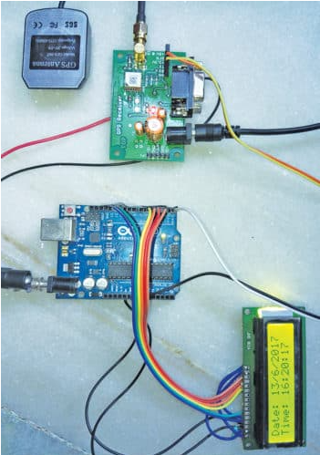
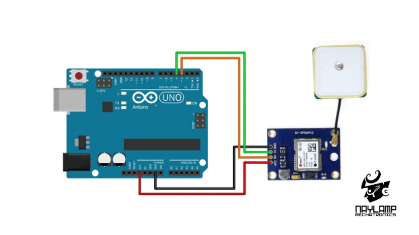
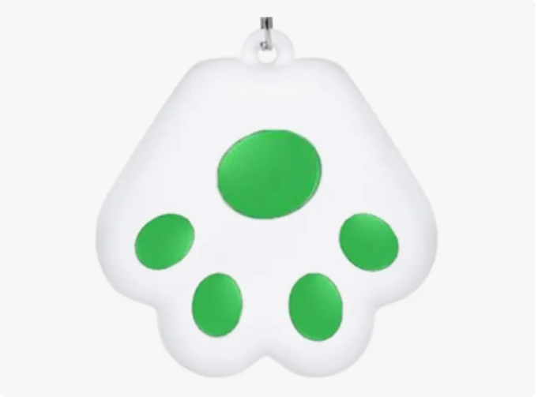
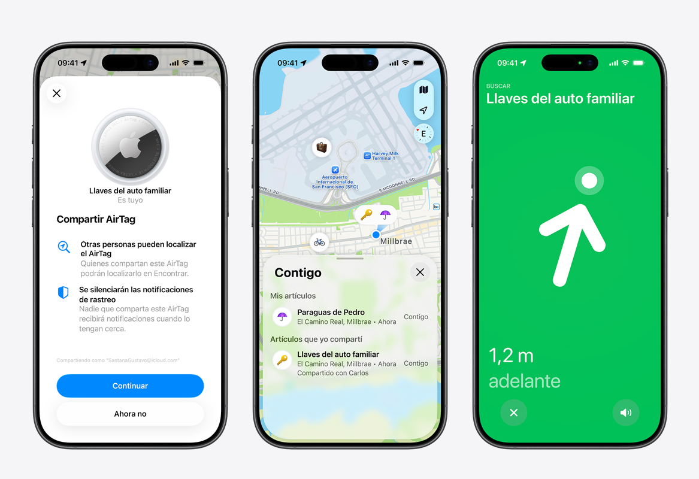

# Dispositivo-lowtech-para-ninos
# Piping call

## Dispositivos lowtech e interfaces interactivas 

**Equipo:** Mártin Palacios Araya, Imay Pizarro Luna

**Problematica:** Dispositivo low-tech de orientación y comunicación bidireccional para el resguardo de menores.

## Descripción

El proyecto aborda el alto costo económico de los sistemas GPS comerciales y la vulnerabilidad de niños de entre 4 y 11 años al extraviarse, quienes carecen de herramientas sencillas para comunicarse o pedir ayuda. Está diseñado para cuidadores (padres, madres o tutores) y sus niños, operando en contextos urbanos de alta concurrencia como plazas, parques y centros comerciales. Para responder a esto, se propone un sistema interactivo bidireccional de bajo costo (Low-Tech) que vincula a ambos usuarios en tiempo real; este no solo permite visualizar la ubicación en mapas, medir la distancia en metros y calcular el tiempo de reencuentro en minutos, sino que también emite señales sonoras, facilita la contención emocional a través de mensajes predeterminados y ofrece una vía expedita para contactar a servicios de emergencia (Carabineros, Bomberos o personal médico).

## Equipo

| Integrantes |
|---|
| Mártin Palacios Araya |
| Imay Pizarro Luna |

## Desafío o problematica  inicial

El alto costo económico de adquisición de los dispositivos GPS comerciales y limita el acceso a herramientas efectivas de monitoreo y comunicación en familias con niños de 4 a 11 años. Al extraviarse en entornos concurridos, los menores de este rango etario carecen de un medio autónomo, sencillo e intuitivo para reportar su situación de peligro o comunicarse de forma fluida. A su vez, los cuidadores quedan desprovistos de canales directos que no solo les indiquen la ubicación precisa en mapas o la distancia relativa hacia el menor, sino que también les permitan enviar contención emocional inmediata o articular respuestas de emergencia ante situaciones críticas.

## Objetivo 

Diseñar un sistema de interfaz e interacción interactiva —compuesto por dos dispositivos Low-Tech vinculados— capaz de enlazar a ambos usuarios mediante el monitoreo de proximidad en metros, la proyección de coordenadas para navegación, el cálculo del tiempo estimado de reencuentro en minutos y la emisión de señales sonoras de rastreo. El desafío contempla además la integración de una plataforma bidireccional de alertas que incorpore un repertorio de mensajes predeterminados de apoyo o auxilio, junto con una vía de enlace directo a los servicios de emergencia (Carabineros, Bomberos o personal médico).

## Usuarios y contexto

El problema afecta a cuidadores (padres, madres o tutores) y a niños y niñas de entre 4 a 11 años durante su vida cotidiana en espacios urbanos de alta concurrencia como parques, plazas y centros comerciales. La evidencia se sostiene en las barreras económicas para mantener servicios GPS de pago y en la vulnerabilidad a la que se exponen los niños al perderse sin una herramienta comprensible para su edad. El contexto de uso exige un sistema accesible que permita tanto el rastreo espacial como el soporte emocional bidireccional —mediante mensajes prediseñados de contención y ayuda (“¿Estás bien?”, “Tengo miedo”, “No te muevas”)— y la capacidad de gestionar auxilio institucional de urgencia si la situación lo requiere.

## Variables
Medir la distancia respectiva desde el dispositivo vinculado al dispositivo Low-Tech (tomando la medida en Metros), poder reconocer la dirección en donde se encuentra el dispositivo Low-Tech además de su ubicación cartográfica.

## Hipótesis
Un conjunto de dos dispositivos vinculados que integre módulos de posicionamiento y comunicación de bajo costo (Low-Tech) permitirá traducir el distanciamiento físico en variables cuantitativas claras (metros, minutos y coordenadas) y cualitativas (alertas sonoras y mensajería intuitiva preseteada), logrando reducir los tiempos de búsqueda, optimizar la reacción en situaciones de desorientación y asegurar una vía expedita de comunicación y contacto con los organismos de emergencia.

## Referentes
## *Referente 1: Reloj GPS con Arduino*

Sacamos beneficios de esta idea por el formato del dispositivo, como sus componentes y codificación.

Usando un SIM28M GPS receiver module como receptor y un Módulo GPS NEO-6M con una antena.

(https://www.electronicsforu.com/electronics-projects/gps-clock-arduino)

## *Referente 2: Módulo GPS con Arduino*

Ejemplo de un código para arduino que muestra la localización del dispositivo mediante la respuesta del registro de salida.

Usando el Módulo GPS NEO-6M

(https://naylampmechatronics.com/blog/18_tutorial-modulo-gps-con-arduino.html)

## *Referente 3: Gps Rastreador*

Ejemplo de una forma práctica de ocultar el gps y volverlo algo cotidiano, se podría presionar de manera convencional sin que tuviera algún indicio de alertar a otros, un ejemplo de hipótesis para nuestro producto final.

(https://articulo.mercadolibre.cl/MLC-613843320-gps-rastreador-anti-perdida-mascotas-bolsos-ninos-_JM?matt_tool=16931662&utm_source=google_shopping&utm_medium=organic
)

## *Referente 4: AirTag*

A partir del referente de AirTag, adaptamos la idea de proyectar en el teléfono móvil los datos clave del dispositivo low-tech vinculado, permitiendo así integrar múltiples funcionalidades de monitoreo.

(https://www.apple.com/cl/airtag/)

## Índice de la bitácora

- [S01 - Entrega 01](bitacora/S01.md)
- [S02 - Entrega 02](bitacora/S02.md)
- [S03 - Entrega 03](bitacora/S03.md)
